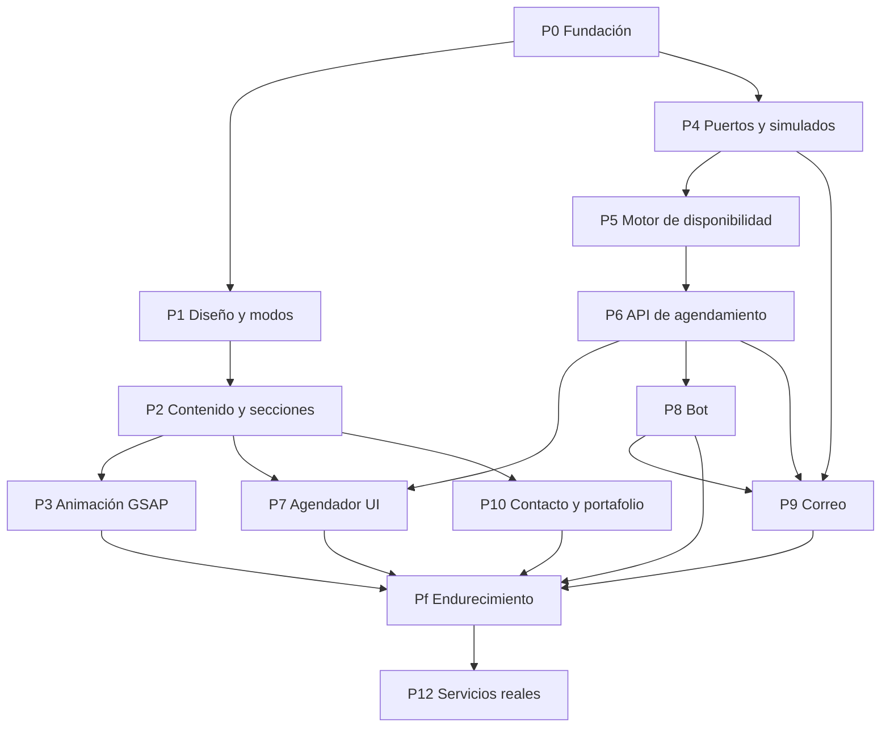

# PLAN-IMPLEMENTACION.md — Paquetes P0 a P12

Un commit por paquete. Cada uno con el protocolo de 7 fases de `docs/PROTOCOLO.md`.

## Dependencias

**Camino crítico: P0 → P4 → P5 → P6 → P7 → Pf.** P5 es el paquete que más riesgo concentra.

---

## P0 — Fundación

**Objetivo:** que exista el esqueleto verificable antes de escribir una línea de producto.

**Entregables:** proyecto Next.js con TypeScript estricto · estructura de capas de `CLAUDE.md` §2 · `npm run audit:fast` y `npm run audit` completos · pre-commit que corre el rápido · `dependency-cruiser` con las reglas de capas · `.env.example` con `MODO_SERVICIOS` y los selectores por servicio · carpeta `infrastructure/fakes/` · registro estructurado con identificador de correlación · cabeceras de seguridad y CSP base · limitador de peticiones base · formato único de error.

**Aceptación:** `npm run audit:fast` pasa en verde · un import de infraestructura desde `domain` **rompe el build** · la app arranca sin ninguna credencial.

> **Antes de arrancar:** confirmar D12 (idioma de identificadores) contra la convención de Commerce.

---

## P1 — Sistema de diseño y modo claro/oscuro

**Objetivo:** que la base visual quede idéntica al prototipo.

**Entregables:** `tokens.css` con los dos modos · fuentes con `next/font` · script inline en `<head>` que fija `data-mode` antes del primer pintado · botón de cambio con persistencia · clase `.inv` para franjas invertidas · componentes de UI base: Boton, Campo, Etiqueta, Estado, Acordeon.

**Aceptación:** los dos modos se ven idénticos al prototipo · **sin parpadeo al cargar en modo oscuro** · contraste AA verificado en ambos modos, con atención a `--texto-2` sobre `--fondo-2`.

---

## P2 — Contenido tipado y secciones estáticas

**Objetivo:** el sitio completo, sin animación y sin API.

**Entregables:** `content/` tipado con productos, servicios, proceso, preguntas, trabajos y textos · las once secciones de `docs/SPEC.md` §6 · barra, pie, adaptación a móvil.

**Aceptación:** **ningún texto de cara al usuario vive dentro de un componente** · se ve idéntico al prototipo en ambos modos · sin mención a facturación SRI en ninguna parte (RN8).

---

## P3 — Capa de animación GSAP

**Objetivo:** RA-01 a RA-05 de `docs/ANIMACION.md`.

**Entregables:** GSAP servido desde el propio dominio · animaciones dentro de `gsap.context()` **con limpieza** · entrada de portada, revelado en cascada, marquesina, barra que se esconde, acordeón · `gsap.matchMedia()` para el corte de móvil.

**Aceptación:** con `prefers-reduced-motion` todo visible y legible · **si GSAP no carga, la página sigue siendo usable** · navegar entre rutas no deja ScrollTriggers huérfanos · CSP sin `unsafe-inline`.

> Si se quieren SplitText o ScrollSmoother, resolver D15 (licencia) antes.

---

## P4 — Puertos, adaptadores simulados y selector de modo

**Objetivo:** la arquitectura de `docs/BUILD.md` §2 y §3.

**Entregables:** puertos `CalendarioPort`, `CorreoPort`, `ChatPort`, `AlmacenPort` · sus cuatro adaptadores simulados con latencia y errores activables · inyección por `MODO_SERVICIOS` y por selector individual · validación de entorno con esquema · bandeja de correo simulada visible en desarrollo.

**Aceptación:** arranca en `demo` sin credenciales · en `real`, **si falta una credencial la app no arranca y dice cuál** (RN10) · nunca cae a simulado en silencio.

---

## P5 — Motor de disponibilidad · **camino crítico**

**Objetivo:** el corazón del dominio, puro y probado.

**Entregables:** cálculo de espacios libres a partir de bloques ocupados y las reglas D1–D3 · manejo explícito de zona horaria `America/Guayaquil` · tipos de dominio (`TimeSlot`, `SlotId`) · conjunto de casos conocidos en `docs/pruebas/casos-conocidos.md`.

**Aceptación:** **las pruebas corren con la base apagada, sin red y sin Google Calendar** · casos límite cubiertos: borde de horario, margen entre reuniones, aviso mínimo, día lleno, cambio de día · si para probarlo hace falta levantar algo, las capas están mal.

---

## P6 — API de agendamiento

**Entregables:** `GET /api/disponibilidad`, `POST /api/reservar`, `GET /api/cita/[token]` · verificación y creación en una operación idempotente · tokens firmados de un solo uso · validación por esquema · límites de uso por endpoint.

**Aceptación:** **dos reservas simultáneas del mismo espacio producen una sola cita y un mensaje claro para la segunda** (RN2) · la respuesta cruda **no contiene detalle de agenda** (RN1) · toda entrada inválida o sobredimensionada se rechaza en el servidor · el token expira, se usa una sola vez y no es adivinable.

---

## P7 — Agendador en la interfaz

**Entregables:** hoja lateral o modal con los tokens del sistema · selección de fecha y hora en la zona horaria del visitante, con la zona indicada en pantalla · formulario de datos · los cuatro estados: cargando, sin espacios, error, éxito.

**Aceptación:** si el calendario falla, **cae con elegancia al formulario de contacto** en vez de mostrar un agendador roto · navegable con teclado, foco atrapado dentro del modal.

---

## P8 — Bot conversacional

**Entregables:** máquina de estados de `docs/SPEC-AGENDAMIENTO-BOT.md` §3 · `FichaProspecto` validada por esquema · `POST /api/chat` y `POST /api/prospecto` con límites por sesión e IP · tope de presupuesto con apagado automático · interruptor manual · widget que **no se abre solo**.

**Aceptación:** no da precios (RN5) · no afirma disponibilidad que el contenido no respalda (RN6) · **ignora instrucciones incrustadas en el mensaje del visitante** · corta al llegar al límite y deriva a WhatsApp · solo notifica con contacto real (RN7) · si la salida no cumple el esquema, se descarta (RN9).

---

## P9 — Correo transaccional

**Entregables:** las cuatro plantillas de `docs/SPEC-AGENDAMIENTO-BOT.md` §5 · envío encolado que no bloquea la respuesta · escapado de todo contenido de usuario.

**Aceptación:** las cuatro se leen bien en la bandeja simulada · **nada de lo que escribió un visitante se inserta como HTML** · un fallo de correo no rompe la reserva.

---

## P10 — Formulario de contacto y portafolio

**Entregables:** `POST /api/contacto` con validación en servidor, campo trampa y verificación de tiempo · sección de trabajos con componente que acepta portada tipográfica **o** imagen.

**Aceptación:** el componente de trabajo no hay que reescribirlo cuando lleguen las capturas reales (C1) · los envíos malformados se rechazan.

---

## Pf — Endurecimiento y auditoría completa

> **Este es el paquete que en otros proyectos está repartido en cada commit.** Acá se concentra, por decisión explícita. Lo que salga en rojo **se corrige, no se documenta como deuda.**

**Entregables:** `npm run audit` completo en verde · checklist manual entera de `docs/AUDITORIA.md` · verificación de las trece casillas de `docs/SEGURIDAD.md` · Lighthouse ≥ 90 en móvil en las cuatro categorías · pruebas de límites y de concurrencia · repaso de accesibilidad con teclado y lector de pantalla · auditoría de dependencias.

**Aceptación:** la lista de "definición de terminado" de `docs/BUILD.md` §7, completa.

---

## P12 — Conexión de servicios reales

**Uno a la vez, verificando cada uno antes del siguiente.** Los demás siguen simulados mientras tanto.

| Orden | Servicio | Se verifica con |
|---|---|---|
| 1 | Correo (Brevo) | Llega un correo de prueba y no cae en spam. SPF, DKIM y DMARC verificados |
| 2 | Calendario (Google) | Un espacio ocupado real desaparece de la lista |
| 3 | Base de datos, si se decidió D5 | La ficha sobrevive a un reinicio |
| 4 | Modelo del bot | Mantiene sus límites bajo conversación real, con tope de presupuesto activo |

**Antes de encender el bot:** aviso de privacidad publicado (C4) y tope de presupuesto configurado y probado (D4).

**Aceptación:** cada servicio verificado de forma independiente · ninguno cae a simulado en silencio · revisión manual de conversaciones durante las primeras semanas.
