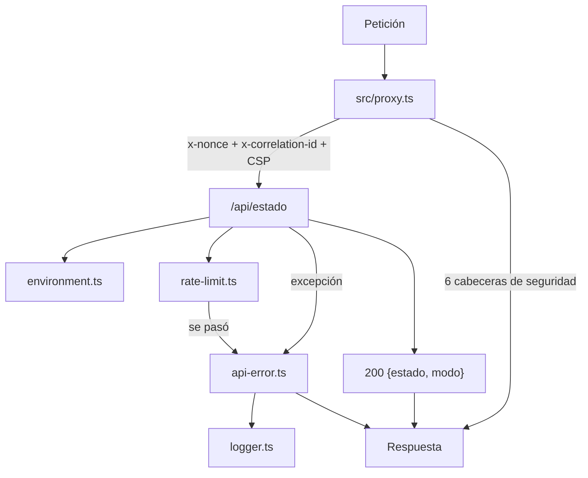

# P0 — Documento de construcción

## Resumen

| Campo | Valor |
|---|---|
| Paquete | P0 — Fundación |
| Fecha inicio / fin | 2026-08-14 / 2026-08-14 |
| Commit final | `{hash}` |
| Secciones del SPEC implementadas | §2 stack · §3 estructura · §8 accesibilidad (base) · §9 rendimiento (presupuestos declarados) |
| Estado | ✅ completado |

## Objetivo del paquete

Que exista el esqueleto verificable antes de escribir una línea de producto: proyecto
Next.js con TypeScript estricto, la estructura de capas de `CLAUDE.md` §2 **hecha
ejecutable**, la cadena de auditoría completa con pre-commit y CI, y las piezas
transversales que toda superficie va a usar.

**Aceptación:** `npm run audit:fast` en verde · un import de infraestructura desde
`domain` rompe la compuerta · la aplicación arranca sin ninguna credencial.

## Plan aprobado

Registrado en modo autónomo (`docs/MODO-AUTONOMO.md`), sin espera de aprobación:

1. Esqueleto: `package.json`, `tsconfig.json`, `next.config.ts`, `.nvmrc`, `.gitignore`, `.env.example`.
2. Estructura de capas de `CLAUDE.md` §2 completa.
3. Cadena de auditoría: dependency-cruiser, ESLint, knip, jscpd, dos scripts propios, pre-commit y CI.
4. Infraestructura compartida: entorno, registro, formato de error, limitador, cabeceras y CSP.
5. `GET /api/estado` como superficie donde todo lo anterior se ejerce y se verifica.
6. Pruebas de cada pieza.

**Dos precondiciones se resolvieron antes de escribir código**, porque
`docs/FASE0-CHECKLIST.md` las marcaba como previas a P0:

- **C2 / D12** — convención de identificadores, verificada contra el **código** de
  Commerce, no contra su documentación (que da ejemplos en español desactualizados).
  → ADR-0001.
- **C1** — qué se extrae de Care. Se revisó su motor real: resuelve un problema
  distinto (múltiples recursos, compatibilidad servicio↔recurso, desempate entre
  profesionales). → ADR-0002, con la decisión marcada para ratificación del usuario.

## Qué se construyó

### Dominio

Ninguno. P0 es la fundación: el dominio llega en P5. `src/modules/*/domain/` existe
vacío y **ya está vigilado** por `audit:arch`, que falla ante el primer import
indebido aunque todavía no haya un solo archivo dentro.

### Casos de uso y puertos

Ninguno. Llegan en P4 y P5.

### Infraestructura

| Adaptador / pieza | Qué resuelve | Archivo |
|---|---|---|
| Proxy de entrada | Cabeceras, CSP con nonce y correlación en toda petición | `src/proxy.ts` |
| Entorno | Único punto que lee `process.env`, validado por Zod al cargar | `src/shared/infrastructure/config/environment.ts` |
| Registro | JSON por línea; campos personales redactados por nombre; control saneado | `src/shared/infrastructure/logging/logger.ts` |
| Descripción de errores | Estrecha un `unknown` capturado sin exponer la traza | `src/shared/infrastructure/logging/describe-error.ts` |
| Correlación | Generación y lectura del identificador | `src/shared/infrastructure/logging/correlation-id.ts` |
| Formato de error | Respuesta de error única en todo el sistema | `src/shared/infrastructure/http/api-error.ts` |
| Limitador | Ventana fija en memoria, `now` inyectado | `src/shared/infrastructure/http/rate-limit.ts` |
| Cabeceras y CSP | Las seis de `SEGURIDAD.md` §4.4 + política estricta | `src/shared/infrastructure/http/security-headers.ts` |
| Clave de origen | Cadena de proxies → clave del limitador, sin registrarla | `src/shared/infrastructure/http/client-ip.ts` |

### Contenido

| Archivo | Qué contiene |
|---|---|
| `src/content/errors.ts` | Catálogo de códigos y mensajes de error visibles |
| `src/content/site.ts` | Nombre, título, descripción y locale del sitio |

Los dos son hojas: `contenido-es-hoja` en dependency-cruiser falla si alguna vez importan algo.

### Superficie

`GET /api/estado` — `docs/apis/estado.md`.

### Migraciones

Ninguna. No hay base de datos en v1 (`CLAUDE.md` §5).

## Diagrama del paquete



## Decisiones técnicas tomadas

| # | Decisión | Alternativas descartadas | Razón | ADR |
|---|---|---|---|---|
| 1 | Identificadores en inglés, archivos `kebab-case` con sufijo de rol | Español, según los ejemplos del doc de Commerce | El **código** de Commerce está en inglés; el documento tiene ejemplos viejos | [0001](../../decisiones/ADR-0001-idioma-y-convencion-de-identificadores.md) |
| 2 | Motor de disponibilidad propio | Extraer el de Care a paquete compartido | El de Care modela recursos y profesionales que acá no existen | [0002](../../decisiones/ADR-0002-motor-de-disponibilidad-propio.md) |
| 3 | Vitest | Jest | Ningún documento nombraba runner; Care usa Vitest y es el repo más cercano | [0003](../../decisiones/ADR-0003-vitest-como-runner-de-pruebas.md) |
| 4 | CSP con nonce y render dinámico | `unsafe-inline`; hashes por build | `SEGURIDAD.md` §4.1 exige nonce, literal | [0004](../../decisiones/ADR-0004-csp-estricta-con-nonce.md) |
| 5 | TypeScript 6.0.3 y ESLint 9.39.5 | TS 7.0.2 / ESLint 10.8.1 | `typescript-eslint` 8.67 no los soporta; sin él se cae el linting tipado | [0005](../../decisiones/ADR-0005-typescript-6-en-lugar-de-7.md) |
| 6 | Registro, limitador y pre-commit propios | Pino, `rate-limiter-flexible`, husky | Sesenta líneas cada uno; `OPTIMIZACION.md` §1 lo prohíbe | [0006](../../decisiones/ADR-0006-utilidades-propias-en-lugar-de-dependencias.md) |
| 7 | `/api/estado` devuelve el modo | No exponerlo | Sin esto, RN10 no se puede verificar tras desplegar | [0007](../../decisiones/ADR-0007-endpoint-de-estado.md) |

## Consultas del camino crítico

No aplica: no hay base de datos.

## Pruebas

| Tipo | Cantidad | Qué cubren |
|---|---|---|
| Unitarias infraestructura | 50 | Registro, correlación, descripción de errores, limitador, clave de origen, cabeceras y CSP, formato de error, entorno |
| Integración | 6 | `GET /api/estado`: responde sin credenciales, no filtra campos, corta en 429 por origen |
| **Total** | **56** | Todas en verde, sin base de datos, sin red y sin servidor levantado |

## Problemas encontrados y cómo se resolvieron

| Problema | Solución | Tiempo perdido |
|---|---|---|
| **La CSP dejaba la página muerta.** Con `strict-dynamic` y la política solo en la respuesta, los scripts en línea de Next quedaban sin firmar: se verificó en un servidor real y llegaban **cero** scripts con nonce | El proxy también escribe la política en las cabeceras reenviadas a la petición —de ahí la toma Next— y `layout.tsx` declara `dynamic = 'force-dynamic'`, porque una página prerenderizada guarda un nonce que ya no coincide. Hay prueba que fija que ambos nonces son el mismo | Alto — y bien gastado: era un fallo que no aparece en ningún test unitario |
| `typescript-eslint` 8.67 revienta con ESLint 10 (`scopeManager.addGlobals is not a function`) y no admite TypeScript 7 | Fijar ESLint 9.39.5 y TypeScript 6.0.3 (ADR-0005) | Medio |
| Next 16 marca `middleware.ts` como obsoleto en favor de `proxy.ts`, con export `proxy` | Migrado antes del primer commit: arrancar sobre una convención ya marcada para morir no tiene sentido | Bajo |
| Next 16 quitó la clave `eslint` de `NextConfig` | Retirada; el linting corre por su propio script | Bajo |
| `Object.entries` sobre una interfaz devuelve `any` en los valores | `SecurityHeaders` pasó a ser un `Record` de claves literales | Bajo |
| knip señaló seis exports sin consumidor | Se dejaron de exportar. Eran API especulativa, justo lo que prohíbe `OPTIMIZACION.md` §1 | Bajo |

## Deuda y pendientes

Ninguna deuda aceptada. Lo que queda es trabajo de paquetes posteriores, no atajos:

- Resolución de selectores por servicio contra el global → **P4**
- Credenciales exigidas en `MODO_SERVICIOS=real` (RN10 completo) → **P4**
- Capas de límite por sesión y por endpoint sensible → **P6** y **P8**
- Medición de LCP con render dinámico → **Pf** (ADR-0004)

## Cómo probar manualmente lo construido

```bash
npm ci
npm run audit          # todo en verde
npm run build
npm start              # arranca sin una sola credencial

curl -s localhost:3000/api/estado
# → {"estado":"ok","modo":"demo"}

curl -sI localhost:3000/ | grep -iE "content-security-policy|x-frame|strict-transport"

# El límite por origen corta a la petición 31
for i in $(seq 1 35); do curl -s -o /dev/null -w "%{http_code} " localhost:3000/api/estado; done
```

**Para comprobar que la regla de dependencia muerde de verdad**, cree un archivo
que la viole y corra la compuerta:

```bash
cat > src/modules/availability/domain/probe.ts <<'EOF'
import { environment } from '@/shared/infrastructure/config/environment';
export const probe = environment.MODO_SERVICIOS === 'demo' && process.env['X'] !== undefined;
EOF

npm run audit:fast; echo "salida=$?"   # → salida=1
rm src/modules/availability/domain/probe.ts
```
