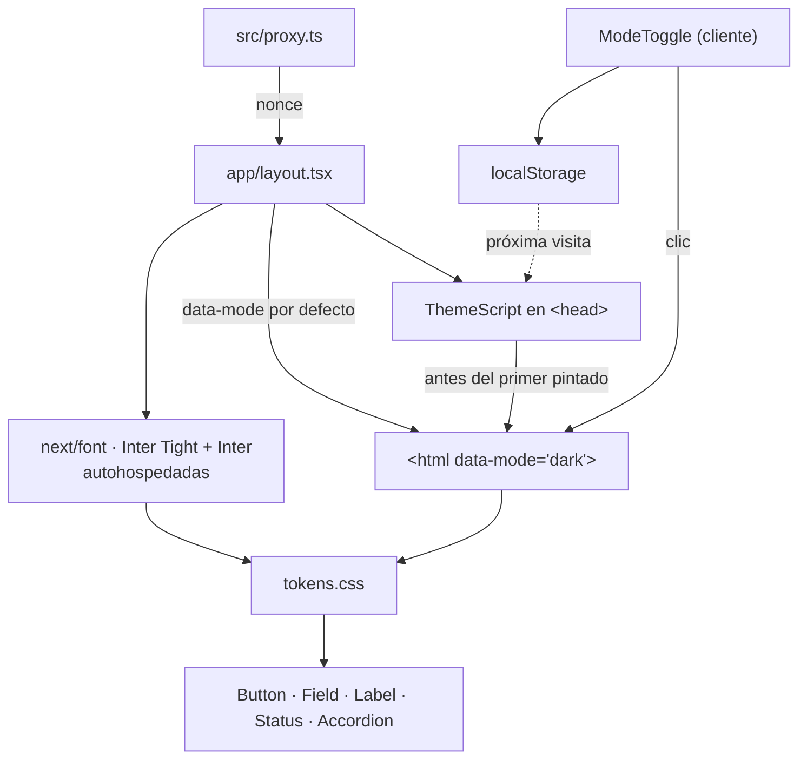

# P1 — Documento de construcción

## Resumen

| Campo | Valor |
|---|---|
| Paquete | P1 — Sistema de diseño y modo claro/oscuro |
| Fecha inicio / fin | 2026-08-14 / 2026-08-14 |
| Commit final | `{hash}` |
| Secciones del SPEC implementadas | §4 sistema de diseño completo · §8.3 foco · §8.5 contraste · §8.7 rótulo del botón de modo |
| Estado | ✅ completado |

## Objetivo del paquete

Que la base visual quede idéntica al prototipo, en los dos modos, y que el modo
se fije **antes del primer pintado** para que no haya parpadeo.

**Aceptación:** los dos modos se ven como el prototipo · sin parpadeo al cargar
en modo oscuro · contraste AA verificado en ambos modos, con atención a
`--texto-2` sobre `--fondo-2`.

## Plan aprobado

Registrado en modo autónomo:

1. `tokens.css` con los valores exactos del prototipo, los dos modos y `.inv`.
2. `base.css`: reinicio, cuerpo, enlaces, foco y jerarquía tipográfica.
3. Fuentes con `next/font`, autohospedadas, solo los pesos que se usan.
4. Script en línea en `<head>` que fija `data-mode` antes de pintar, con nonce.
5. Botón de cambio de modo con persistencia.
6. Los cinco componentes base.
7. Prueba de contraste que **calcula** la razón WCAG en vez de afirmarla.

## Qué se construyó

### Tokens y base

| Archivo | Qué contiene |
|---|---|
| `src/styles/tokens.css` | Los dos modos, `.inv` con sus sobrescritos anidados, y las variables de fuente que llena `next/font` |
| `src/styles/base.css` | Reinicio, cuerpo, enlaces, foco visible y jerarquía `h1`–`h4`. Movimiento reducido, que vive acá y no en la capa de animación para que valga aunque GSAP no cargue |

### Modo claro/oscuro

| Archivo | Qué resuelve |
|---|---|
| `components/theme/theme.ts` | El contrato: los dos modos, el atributo, la clave de almacenamiento y el modo de respaldo. Un solo lugar, para que el script y el botón no puedan desincronizarse |
| `components/theme/theme-script-source.ts` | El script que corre antes del primer pintado. Sin JSX, para poder **ejecutarlo** en una prueba |
| `components/theme/theme-script.tsx` | Lo inserta en el `<head>` con el nonce de la petición |
| `components/theme/mode-toggle.tsx` | El botón. Sin estado: el modo vive en el atributo y el icono lo decide el CSS |

### Componentes de UI

`SPEC.md` §3 los nombra en español; van en inglés por `CLAUDE.md` §3 (ADR-0008).
La correspondencia, para que nadie lea el plan y crea que falta algo:

| SPEC | Archivo | API |
|---|---|---|
| `Boton` | `components/ui/button.tsx` | `variant="solid" \| "outline"`, `href` opcional |
| `Campo` | `components/ui/field.tsx` | `htmlFor`, `label`, control como hijo |
| `Etiqueta` | `components/ui/label.tsx` | — |
| `Estado` | `components/ui/status.tsx` | `available` |
| `Acordeon` | `components/ui/accordion.tsx` | `items` |

### Contenido

| Archivo | Qué contiene |
|---|---|
| `src/content/ui.ts` | Rótulos de la interfaz. Un `aria-label` es texto de cara al usuario: es lo único que oye quien usa lector de pantalla |
| `src/content/design-system-preview.ts` | Textos de la vista de P1. **P2 lo borra** junto con la página |

## Diagrama del paquete



## Decisiones técnicas tomadas

| # | Decisión | Alternativas descartadas | Razón | ADR |
|---|---|---|---|---|
| 1 | Componentes en inglés, tokens en español | Todo en español; todo en inglés | Los tokens son contrato compartido con Commerce y Care; los componentes son código | [0008](../../decisiones/ADR-0008-nombres-de-componentes-en-ingles-y-tokens-en-espanol.md) |
| 2 | Corregir el uso de `--texto-3`, no la paleta | Cambiar los valores del prototipo; anotarlo como deuda | El prototipo manda en lo visual; el que estaba mal era el uso | [0009](../../decisiones/ADR-0009-contraste-verificado-y-dos-desvios-del-prototipo.md) |
| 3 | `data-mode` por defecto desde el servidor + `suppressHydrationWarning` | Dejar el `<html>` sin atributo | Sin atributo no hay un solo token de color definido: con JavaScript deshabilitado la página perdía toda la paleta | — |
| 4 | Excepción declarada y **impresa** de `html-crudo` para el script del modo | Prohibirlo sin matiz; un archivo externo | `CLAUDE.md` §10 exige el script en línea y §8 solo prohíbe HTML crudo **con contenido de usuario**. El check de P0 era más ancho que la regla | — |

## Pruebas

| Tipo | Cantidad | Qué cubren |
|---|---|---|
| Contraste calculado | 12 | AA de `--texto` y `--texto-2` sobre los dos fondos, en los cuatro contextos; que `.inv` invierta también `--fondo-2`; que el marcador de posición no use el token decorativo |
| Script del modo, ejecutado | 5 | Respeta lo elegido, sigue al sistema en la primera visita, ignora un valor inválido, sobrevive a un almacenamiento roto, y **nunca deja la página sin modo** |
| Contrato del modo | 3 | Los dos modos, el reconocimiento y el opuesto |
| **Nuevas en P1** | **20** | Total del proyecto: **76** |

Los componentes no llevan prueba de render: no se trajo un entorno de DOM ni
biblioteca de pruebas de React para eso. `CLAUDE.md` §7 pone la interfaz en
prioridad 🟡 con Playwright, y `BUILD.md` §5 dice que no necesita cobertura
exhaustiva. Llega en P7 y Pf, con recorridos reales.

## Problemas encontrados y cómo se resolvieron

| Problema | Solución | Tiempo perdido |
|---|---|---|
| El script en línea necesita `dangerouslySetInnerHTML`, que el check de P0 prohibía sin matiz. React escapa las comillas de un `<script>{código}</script>` y `next/script` usa `dangerouslySetInnerHTML` internamente, así que no había forma de esquivarlo | Se ajustó el check a la regla real de `CLAUDE.md` §8 —que prohíbe HTML crudo **con contenido de usuario**— con una excepción única, declarada e **impresa en cada corrida** | Medio |
| Sin `data-mode` en el `<html>`, la página sin JavaScript se quedaba sin un solo token de color | El servidor emite el modo por defecto y el script lo corrige antes de pintar | Bajo |
| La prueba de contraste encontró dos fallos reales del prototipo | ADR-0009 | Medio — y era el punto de escribirla |
| La página de vista previa pasaba de 40 líneas por función | Se partió en cuatro componentes. El umbral hizo su trabajo | Bajo |

## Deuda y pendientes

Ninguna deuda. Pendiente de paquetes posteriores:

- **P2 borra** `src/app/page.tsx`, `src/app/page.module.css` y
  `src/content/design-system-preview.ts`, y pone las once secciones.
- **P3** anima la altura del acordeón interceptando el clic del `summary`, sin
  romper el teclado (`SPEC.md` §8.4).
- **Pf** revisa `--texto-3` con las once secciones puestas (ADR-0009).

## Cómo probar manualmente lo construido

```bash
npm run build && npm start
```

Abrir `localhost:3000` y comprobar:

1. **Sin parpadeo.** Con el sistema en oscuro, recargar varias veces: no debe
   verse un destello claro. Cambiar el sistema a claro y repetir.
2. **Persistencia.** Pulsar el botón de modo, recargar: se mantiene el elegido,
   aunque el sistema pida el contrario.
3. **Sin JavaScript.** Deshabilitarlo y recargar: la página se ve completa, en
   modo oscuro.
4. **Teclado.** Recorrer con `Tab`: el foco se ve siempre. El acordeón abre y
   cierra con `Enter`.
5. **Franja invertida.** La última sección usa el esquema contrario, y su texto
   secundario sigue legible.

```bash
# Contraste, calculado y no opinado
npx vitest run src/styles/contrast.spec.ts

# El script del modo, ejecutado contra un documento falso
npx vitest run src/components/theme/theme-script-source.spec.ts
```
