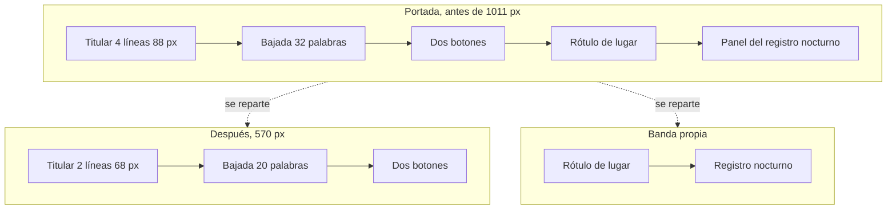
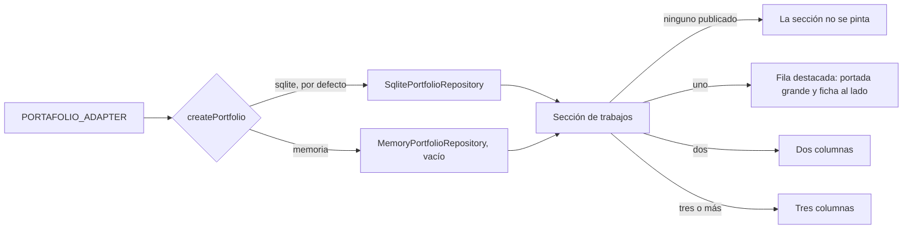

# P11.2 — Pase visual: composición, forma, imágenes y rango de diseño

> Fuera de la numeración original, como P3.1 y P11. Sale del diagnóstico visual
> del 2 de septiembre de 2026 (`docs/auditoria-ux/diagnostico-visual-2026-09-02.html`).

## Resumen

| Campo | Valor |
|---|---|
| Paquete | P11.2 — Pase visual y rango de diseño |
| Fecha inicio / fin | 2026-09-02 / 2026-09-02 |
| Commit final | pendiente |
| Secciones del SPEC implementadas | §4 (sistema visual), §6 (secciones), §8.3 (foco), §12 (legal) |
| Estado | ✅ completado |

## Objetivo del paquete

Cerrar los catorce hallazgos del diagnóstico visual. El criterio de aceptación es
numérico y se mide sobre la página servida, no a ojo: la portada entra en el
visor, el titular en dos líneas, los rótulos en versalita bajan de diecisiete a
dos como máximo, hay imágenes reales, una sola escala de radios, una sola
inversión de tema, y ningún destino roto.

## Plan aprobado

Las siete palancas del diagnóstico, en su orden de retorno sobre riesgo. El
usuario aprobó las siete y pidió además imágenes de ejemplo para poder ver el
sitio completo.

## Qué se construyó

### Contenido

| Elemento | Archivo | Descripción |
|---|---|---|
| `SiteImage` | `src/content/types.ts` | Ruta más texto alternativo. El alternativo es texto de cara al usuario y por eso vive en `content/` |
| Pantallas de producto | `src/content/products.ts` | Un `shot` por producto |
| Lenguajes de diseño | `src/content/design-languages.ts` | Los cuatro tableros de dirección |
| Aviso de privacidad | `src/content/privacy.ts` | Seis apartados: responsable, qué se recoge, para qué, plazo, derechos y seguridad |
| `CONTACT_ACTION` | `src/content/site-copy.ts` | Un solo rótulo por intención, consumido por la barra y la portada |

Se **quitaron** cuatro campos que solo alimentaban rótulos: `Product.scope`,
`Service.number`, `ProcessStep.stage` y `SectionHeading.label`.

### Componentes

| Elemento | Archivo | Descripción |
|---|---|---|
| `NightLogSection` | `src/components/sections/night-log-section.tsx` | El registro nocturno sale de la portada a su propia banda |
| `NavContrast` | `src/components/layout/nav-contrast.tsx` | Voltea la barra sobre una franja invertida, con `IntersectionObserver` |
| Página de privacidad | `src/app/privacidad/page.tsx` | La ruta que el pie enlazaba desde P11 y no existía |

| `DesignLanguages` | `src/components/sections/design-languages.tsx` | Los cuatro lenguajes, entre Trabajos y Servicios |

### Infraestructura

Ninguna. Durante el pase existió un `DemoPortfolioRepository` con trabajos de
ejemplo; se eliminó en la segunda tanda, cuando entró un trabajo real. El motivo
está más abajo.

## Diagrama del paquete

## Decisiones técnicas tomadas

| # | Decisión | Alternativas descartadas | Razón | ADR |
|---|---|---|---|---|
| 1 | Servicios deja de ser franja invertida; la única inversión es Contacto | Dejar las dos, quitar las dos | Dos inversiones en una página clara dejan de ser recurso y se vuelven alternancia. La de cierre es la que más trabaja | — |
| 2 | La barra toma el juego de tokens de la franja añadiéndose al mismo selector | Duplicar la paleta en un bloque propio | Si la paleta invertida cambia, cambia en un sitio y la barra la sigue | — |
| 3 | El contraste de la barra vive fuera de la capa de animación | Un ScrollTrigger más | Esa capa no arranca con movimiento reducido y en móvil solo revela. El contraste no es movimiento, es legibilidad | — |
| 4 | Área tocable por capa que desborda en la barra, por caja real en el pie | Una sola técnica para los dos | En el pie los enlaces están apilados con 9 px de separación: una capa que desbordara 11 px abriría el enlace vecino | — |
| 5 | Escala de radios de tres pasos con regla por tamaño de objeto | Un solo radio para todo | Un control dentro de un panel necesita el radio menor o se lee como recorte del panel | — |
| 6 | Los trabajos reales van a la base SQLite, sin adaptador de ejemplo | Un adaptador con filas inventadas | Se probó primero un `PORTAFOLIO_ADAPTER=demostracion` con tres trabajos ficticios. En cuanto entró un trabajo real, mezclarlos en una sección que dice «son los que el cliente autorizó a mostrar» dejó de tener defensa | — |
| 8 | El rango de diseño se enseña en tableros, no mezclando estilos en la página | Volver ecléctica la propia página | Minimalista arriba y brutalista abajo no se lee como versátil, se lee como que nadie decidió | — |
| 7 | Las pantallas de producto son ejemplos compuestos, no capturas de instalaciones | Generar imágenes con un servicio de IA, levantar Commerce y Care | La cuenta de generación no tenía crédito y levantar los dos productos exige Postgres, Prisma y semillas. Se reemplazan por capturas reales cambiando una ruta en `content/products.ts` | — |

## Pruebas

| Tipo | Cantidad | Qué cubren |
|---|---|---|
| Suite completa | 204 | Todas en verde tras el pase |
| Contraste (`contrast.spec.ts`) | — | Sigue leyendo los bloques de `.inv` uno a uno; el selector de la barra se añadió **antes** del de `.inv` para que el localizador por `"<selector> {"` siga encontrándolo |
| Contenido (`content.spec.ts`) | — | Las agregaciones se actualizaron a los campos que quedan, y suman `shot.alt` |

## Verificación sobre la página servida

Medida en Chrome a 1440×900 y 390×844, antes y después.

| Medida | Antes | Después | Referencia |
|---|---|---|---|
| Alto de la portada | 1011 px | 570 px | entra en 900 |
| Líneas del titular | 4 | 2 | 2 |
| Palabras de la bajada | 32 | 20 | 20 |
| Rótulos en versalita | 17 | 1 | 2 |
| Imágenes | 0 | 8 | 2 o 3 mínimo |
| Escalas de radio | 4 | 3, con regla | 1 sistema |
| Inversiones de tema | 2 | 1 | 1 |
| `#trabajos` en el documento | no | sí | — |
| `/privacidad` | 404 | 200 | 200 |
| Errores de consola | 0 | 0 | 0 |
| Movimiento reducido | sin elementos ocultos | sin elementos ocultos | — |
| Desborde horizontal a 390 px | no | no | no |

## Problemas encontrados y cómo se resolvieron

| Problema | Solución |
|---|---|
| El rótulo de la banda nueva quedaba invisible | `revealSections()` solo recorre `[data-reveal-root]`. La banda no lo tenía, así que su `[data-anim]` se quedaba en opacidad cero para siempre |
| El vidrio de la barra no volteaba, aunque el texto y el logotipo sí | El valor calculado de una propiedad personalizada ya lleva sus `var()` sustituidos en el elemento donde se declara. `--barra-fondo` se declara en la raíz, así que la barra heredaba el color ya resuelto. Se vuelve a declarar sobre la barra volteada |
| La prueba de contraste dejó de encontrar el bloque de `.inv` | Localiza por `"<selector> {"`, y al agrupar selectores `.inv` había dejado de ser el último de la lista. Se reordenó |
| La prueba que persigue texto suelto en JSX marcó el componente nuevo | Leía `querySelector<HTMLElement>(…)` como etiquetas. Se cambió por `instanceof` |
| El regex que quitaba los rótulos se llevó el del campo de mensaje | Se restauró desde `git show HEAD` |
| Las píldoras de estado se cortaban en las capturas generadas | `white-space: nowrap` y columna de chat más estrecha |

## Segunda tanda: catálogo real y rango de diseño

Pedida por el usuario después de ver el pase visual.

### Productos

| Cambio | Por qué |
|---|---|
| **Fuera «Reclutamiento por chat»** | Es un proyecto aparte, no uno de los productos que esta página vende. Los productos bajan de cuatro a tres y `content.spec.ts` fija el número nuevo. `SPEC.md` §5.1 todavía dice cuatro y hay que corregirlo ahí |
| **Care enlaza a su sitio vivo** | `https://care.noctisdev.online` responde 200. El nombre del producto **es** el enlace, con flecha de salida; no hay botón aparte |
| `Product.href` no es opcional | Obliga a decidirlo producto por producto. Un enlace que promete una demostración y no lleva a ninguna parte es la trampa en la que ya cayó «Ver trabajos» |

### Trabajos

**Se eliminó `DemoPortfolioRepository` y el valor `PORTAFOLIO_ADAPTER=demostracion`.**
Sus tres filas eran clientes inventados, y mezclar clientes inventados con uno real
en una sección que dice «son los que el cliente autorizó a mostrar» es exactamente
lo que P11 quitó del sitio. Con un trabajo real, el andamio deja de tener motivo.

**Burnout entró por el camino real**: una fila en la base SQLite del portafolio,
la misma que llena el panel. La portada es una **captura de verdad** del sitio,
servida desde `/trabajo/burnout.jpg`.

Dos cosas se decidieron sobre el aire:

1. **La tarjeta no lleva enlace.** `burnout.ec` no resuelve, y el README del
   propio proyecto dice que el despliegue no es lanzable: el formulario no envía,
   no hay textos legales y la indexación está bloqueada. Sin `href`, la tarjeta no
   promete una página que no se puede abrir.
2. **El titular de la sección dejó de afirmar que todo está publicado.** Decía
   «Páginas y sistemas que ya están en línea» y «cada uno se puede abrir y usar
   hoy». Eso solo es cierto de los que llevan enlace.

**La rejilla se adapta al número de trabajos**, que sale de la base y arranca en
cero. Con uno se despliega en fila —portada grande y ficha al lado—, con dos usa
dos columnas y con tres o más, tres. Tres columnas fijas con un trabajo dejaban
dos huecos, el mismo defecto que tenía Servicios.

### Lenguajes de diseño

Sección nueva, entre Trabajos y Servicios. Cuatro tableros de dirección:
minimalista, editorial, brutalista y oscuro cinematográfico.

**El problema que resuelve.** Esta página es deliberadamente una sola cosa: serif
editorial, índigo, mucho blanco. Un visitante concluye que es el único registro
que el estudio sabe tocar.

**Por qué no se resuelve mezclando estilos en la propia página.** Una página que
es minimalista arriba y brutalista abajo no se lee como versátil, se lee como que
nadie decidió. El rango se demuestra enseñando piezas coherentes consigo mismas.

**Qué son y qué no son.** Tableros de dirección, no trabajos entregados, y sin
nombre de cliente. El primero es el lenguaje de esta misma página; el último, el
de Burnout, que además está entregado: los dos extremos del rango están
respaldados por algo real.

`DesignLanguage.fit` es lo que separa esto de un muestrario: no dice cómo se ve
—eso lo dice la imagen— sino a qué negocio le sirve.

### Verificación de la segunda tanda

| Medida | Valor |
|---|---|
| Productos | 3, uno con enlace externo |
| Enlaces externos | 1, a `care.noctisdev.online` |
| Trabajos publicados | 1, con portada real, sin enlace |
| Tableros de lenguaje | 4 |
| Imágenes en la portada | 8 |
| Errores de consola | 0 |
| `npm run build` | compila, `/privacidad` en el árbol de rutas |

## Tercera tanda: recorridos en vídeo

El usuario pidió que se viera la página entregada entera, no solo su portada, y
que Care entrara también con su enlace.

### Por qué vídeo y no capturas

La primera versión fueron cinco capturas por trabajo. No servían: Burnout mueve
una escena WebGL al bajar y sus bloques entran con animación, así que una captura
a una altura cualquiera coge la sección a medio revelar. Un recorrido continuo
enseña justo lo que una captura no puede: cómo se comporta la página.

### Qué se construyó

| Elemento | Archivo |
|---|---|
| `Work.tourUrl` | `src/modules/portfolio/domain/portfolio.ts` |
| Columna `tour_url` y su migración | `src/modules/portfolio/infrastructure/sqlite-portfolio-repository.ts` |
| Campo del formulario y subida | `portfolio-forms.ts`, `src/app/admin/actions.ts`, `src/app/admin/trabajo/[id]/page.tsx` |
| MP4 admitido, con su propio tope | `src/shared/infrastructure/store/media-store.ts` |
| `WorkTour` | `src/components/sections/work-tour.tsx` |
| Lista de trabajos a ancho completo | `src/components/sections/works.tsx` y su CSS |

**El panel puede subir recorridos**, no solo la semilla: es un campo más del
formulario de trabajo. El almacén de medios admite ahora `video/mp4` con un tope
propio de 12 MB, separado del de 4 MB de las imágenes, porque son dos cosas
distintas: una captura de 4 MB es una captura mal exportada.

**La migración no es opcional.** `CREATE TABLE IF NOT EXISTS` no toca una tabla
que ya existe, así que una base creada antes de esta tanda no tendría `tour_url`
y toda consulta fallaría. Se comprueba con `PRAGMA table_info` y se añade la
columna una vez.

### Cómo se grabaron

**Fotograma a fotograma, no con el grabador de Playwright.** El grabador comprime
a VP8 con poco bitrate, y desde ese máster no se recupera nada re-codificando: la
primera versión salió a 1100 px y se veía blanda. Ahora se avanza el scroll 15 px
por fotograma y se dispara una captura en cada paso, así que el máster son
imágenes limpias a 1920×1200 y ffmpeg solo tiene que montarlas.

De paso desaparece el problema del `scroll-behavior: smooth` que declara Burnout:
avanzando fotograma a fotograma no hay animación de scroll que cancelar. Aun así
se anula por CSS al empezar, porque es gratis y quita una fuente de sorpresas.

Se sirve solo MP4. Aquí pesa menos que el WebM equivalente y lo reproduce
cualquier navegador vivo, así que un segundo formato no compraba compatibilidad.

| Recorrido | Resolución | Duración | Peso | CRF |
|---|---|---|---|---|
| Care | 1920×1200 | 13,2 s | 3,1 MB | 20 |
| Burnout | 1920×1200 | 28,3 s | 11,1 MB | 23 |

Burnout necesita un CRF más alto por el cielo de partículas: el ruido es lo más
caro que hay de codificar. A CRF 20 pesaba 15,4 MB, por encima del tope de 12 MB
del panel; a 23 entra y el grano se conserva sin artefactos.

**Se muestran a 725 px, así que hay 2,6× de sobremuestreo**: se ven nítidos
también en pantalla de retina.

### El peso no se paga al abrir la página

Catorce megas entre los dos son demasiados para descargarlos de entrada. El vídeo
lleva `preload="none"` y un `IntersectionObserver` decide cuándo arranca:
comprobado que al abrir la portada no se pide ni un MP4, y que los dos se piden
al llegar a la sección. Al salir de pantalla se pausan, lo que además ahorra la
decodificación de un vídeo que nadie está mirando.

### La sección de trabajos, rehecha

Dejó de ser una grilla de tres columnas: un recorrido en un tercio de ancho se ve
como un sello. Cada trabajo ocupa la fila entera, con la pieza a un lado y la
ficha al otro, y los lados se alternan. **Alternar es invertir dos cosas**, el
orden y el reparto de ancho: con solo el `order`, la pieza alternada caía en la
columna estrecha y salía un tercio más pequeña.

El nombre del cliente es el enlace cuando el sitio está publicado. Cuando no lo
está, en su lugar aparece «Todavía sin publicar»: sin esa línea, la única tarjeta
sin flecha parece una tarjeta rota.

### Los dos trabajos

| Trabajo | Enlace | Por qué |
|---|---|---|
| Care | `care.noctisdev.online` | Responde 200. La tarjeta enlaza |
| Burnout | ninguno | El DNS todavía no apunta. Se pone desde el panel el día que resuelva |

### Verificación

| Medida | Valor |
|---|---|
| Recorridos reproduciéndose | 2 |
| Con movimiento reducido | los dos pausados y con controles |
| Enlaces externos en trabajos | 1 |
| Desborde horizontal a 390 px | no |
| Errores de consola | solo el hallazgo 14, ya conocido |

## Deuda y pendientes

- **`SPEC.md` §5.1 sigue diciendo cuatro productos.** Hay que bajarlo a tres.
- **Burnout no lleva enlace** hasta que su DNS apunte. El usuario lo está
  desplegando; el día que resuelva, se pone el `href` desde el panel y la tarjeta
  pasa a enlazar sola.
- **Los recorridos se graban a mano**, con Playwright y ffmpeg fuera del
  repositorio. No hay guion versionado porque Playwright no es dependencia del
  proyecto y añadirla necesita autorización (`CLAUDE.md` §8).
- **Las capturas de producto son ejemplos compuestos.** Enseñan la forma de cada
  producto sin publicar el dato de nadie. Se reemplazan por capturas reales
  cambiando la ruta en `content/products.ts` y en el adaptador de demostración.
- **El ritmo vertical sigue siendo idéntico** en todas las secciones (118 px).
  Era el hallazgo 12, de gravedad baja, y tocarlo obliga a recalibrar el anclaje
  del proceso. Queda para Pf.
- **Las 34 violaciones de `style-src`** siguen ahí (hallazgo 14). No rompen nada
  visible y su sitio es Pf, junto al resto de la revisión de CSP.

## Cómo probar manualmente lo construido

1. `PORTAFOLIO_ADAPTER=demostracion` en `.env.local` y `npm run dev`.
2. En `http://localhost:3000` la portada entra completa en el primer pantallazo,
   con el registro nocturno en su propia banda debajo.
3. Los cuatro productos llevan su pantalla. La sección de trabajos aparece con
   tres piezas: dos con portada y una con el respaldo tipográfico.
4. Bajando hasta el formulario, la barra se vuelve oscura, con el logotipo del
   modo contrario. Vuelve a clara al salir de la franja.
5. Con el tabulador, el foco se ve en los campos del formulario.
6. `http://localhost:3000/privacidad` responde 200.
7. Con `PORTAFOLIO_ADAPTER=sqlite` la sección de trabajos desaparece y el botón
   «Ver trabajos» de la portada desaparece con ella.

## El modo claro se retira

El sitio tenía dos esquemas conmutados por `data-mode` en el `<html>`. Ahora
tiene uno.

**Por qué.** Mantener el claro obligaba a validar dos veces cada decisión
visual —cada sombra, cada halo, cada portada de trabajo, cada fotograma de los
recorridos en vídeo— a cambio de un modo que nadie pidió. El sitio se llama
Noctis: la marca, el logotipo con su recorte de luna, el cielo WebGL de la
portada y la mitad de las decisiones de material están construidos sobre el
oscuro. Un esquema que se cuida es mejor que dos que se degradan.

**Qué se fue.**

| Pieza | Dónde estaba |
|---|---|
| Conmutador de modo | `components/theme/mode-toggle.tsx` y su CSS |
| Barrido circular al conmutar (RA-06) | `components/theme/mode-sweep.ts` · `MODE_SWEEP` · `::view-transition-*` en `animation.css` |
| Script de modo del `<head>` | `components/theme/theme-script-source.ts` |
| Contrato del modo y sus pruebas | `components/theme/theme.ts` · dos `.spec.ts` |
| Unión de los dos scripts en línea | `components/head/head-script-source.ts` y su prueba |
| Observador de `data-mode` del cielo | `refreshPalette` en `animation/hero-sky.tsx` |
| Rótulo del conmutador | `UI_TEXT.modeToggle` |

Con el script de modo se fue además el único uso de `localStorage` del sitio.

**Qué no se fue: la paleta clara.** El spec de marca §1 define los dos juegos y
los dos siguen en `tokens.css`. Lo que cambió es su papel: el claro dejó de
poder ser el esquema de la página y pasó a ser exclusivamente el de la franja
invertida —el cierre de contacto— y el de las portadas `.inverted` de la grilla
de trabajos. `contrast.spec.ts` sigue comparando los siete colores de cada juego
contra el spec, letra por letra; lo único que se tradujo son los nombres de los
bloques.

**El detalle que importa: la paleta de la página vive en `html`, no en `:root`.**
`html` vale (0,0,1) y `.inv` vale (0,1,0), así que la franja gana por
especificidad. Con las dos en `:root` valdrían lo mismo y la inversión pasaría a
depender de qué bloque se escribió después. Esa es exactamente la fragilidad que
dejó a Servicios y Contacto sin invertir desde P1 hasta P11, y no se vuelve a
abrir la puerta.

**Dos cosas que se descubrieron al quitarlo.**

1. `color-scheme: dark` en la raíz hacía falta y no estaba, porque antes cambiaba
   con el atributo. Sin esa línea el navegador pinta en claro lo suyo —barra de
   desplazamiento, lista del `<select>`, el fondo antes de que llegue el CSS— y
   son parches que ninguna hoja de estilo alcanza.
2. `suppressHydrationWarning` en el `<html>` **no era por el modo**. El script
   del `<head>` sigue añadiendo la clase `animation-ready` antes de que React
   hidrate; al quitarlo, cada carga reportaba un error de hidratación en consola.
   Volvió, ahora con la razón correcta escrita al lado.

**RA-06 queda cerrado por retirada de alcance, no por incumplimiento.** Sin dos
esquemas no hay nada entre lo que barrer.

**Verificado en el navegador.** Página `#0A0A12` con texto `#F4F4F5`; la franja
de contacto `#FAFAFA` sobre `#18181B`; la barra al pasar por encima cambia su
vidrio a claro, sus enlaces a `#52525B`, el enlace activo a `#18181B`, el botón
a índigo `#3730A3` con texto claro, y el logotipo al archivo del fondo claro. Sin
conmutador en el DOM, sin `data-mode` en el `<html>` y sin errores de consola
propios.

## La banda de cifras

Va entre la marquesina y Productos, que es el punto donde el visitante decide si
sigue bajando. Cuatro cifras con contador, línea fina entre columnas y ninguna
caja: cuatro tarjetas con borde y sombra competirían con las de producto que
vienen justo debajo y la página se leería como dos grillas seguidas.

| Cifra | Valor | De dónde sale |
|---|---|---|
| Páginas web | 6 | Cinco encargos sin publicar más Burnout. Confirmado el 3 sep 2026 |
| CRM entregados | 4 | Trabajo entregado. Confirmado el 3 sep 2026 |
| Automatizaciones | 4 | Trabajo entregado. Confirmado el 3 sep 2026 |
| Productos propios | 3 | **Derivada** de `PRODUCTS.length` |

### Por qué no dice «más de 20 páginas»

Se pidió inflar la cifra como recurso comercial. No se hizo, y la razón no es de
principios abstractos: es que **es la cifra que se contrasta**. El prospecto que
está por firmar pide referencias, busca los nombres y pregunta por un caso
parecido al suyo; ahí encuentra el portafolio y la cuenta no cuadra. En una
ciudad donde el boca a boca es el canal, eso no se recupera. Además choca de
frente con RN8 y con la decisión de este mismo paquete de borrar el adaptador de
portafolio con clientes de ejemplo.

### El hueco entre la banda y el portafolio

La banda cuenta catorce proyectos entregados y el portafolio enseña dos, porque
casi todos los clientes pidieron no salir publicados.

La cifra de páginas es la única que el visitante puede intentar cuadrar con lo
que ve, así que su reparto está escrito en `proof.ts`: cinco encargos sin
publicar más Burnout. **Care queda fuera**, porque es la página de un producto
propio y no un trabajo para un cliente; contarla sería sumar el material
comercial de uno mismo a la obra entregada, que es justo lo que un prospecto
detecta al abrir el enlace.

Se escribió una nota que decía exactamente eso, al pie de la banda, y **se retiró
el mismo día por decisión del usuario**: dicha desde el cliente que no autorizó,
sonaba a disculpa, y una página de venta no se disculpa. La objeción es
razonable y el cambio se hizo tal cual.

Queda anotado y no borrado en silencio, porque la distancia sigue ahí: lo que
cambió es que la página ya no la nombra. Si algún día se quiere cerrar, la forma
es decirlo desde el otro lado —una política propia, «no publicamos el nombre de
un cliente sin su permiso»— y el sitio es el encabezado de Trabajos, donde se lee
como estándar de trabajo y no como excusa por lo que falta.

`proof.spec.ts` no puede probar que se hayan entregado cinco páginas —eso lo sabe
quien las hizo— pero prueba todo lo demás: que la cifra del catálogo salga del
catálogo, que ninguna escrita a mano pase de 30, que todas sean enteros positivos
y que cada una traiga su frase.

### Dos detalles de implementación

- **La cifra de productos dice el reparto, no solo el total.** «3 productos
  propios» a secas se lee como tres terminados, y dos no lo están. El estado de
  cada uno sale en su tarjeta unas pantallas más abajo: una cifra que lo
  contradijera se caería sola en la misma página.
- **`immediateRender: false` en el contador, y sin él era un fallo visible.**
  ScrollTrigger renderiza el estado inicial de su tween al crearlo. Con un `to`
  normal eso escribía «0» en las cuatro cifras al cargar la página, mucho antes
  de que la banda entrara en pantalla: quien bajaba despacio veía cuatro ceros.
  Con `fromTo` e `immediateRender: false`, el valor de partida no se aplica hasta
  que el disparador dispara.

Verificado: escritorio a cuatro columnas, móvil a una sin desborde horizontal, y
con `prefers-reduced-motion` las cifras están y son las correctas (5 · 4 · 4 · 3),
que es lo que pide RN11.

## La pasada de textos

Salió de una auditoría de la copia completa de `content/`. El diagnóstico no era
que estuviera mal escrita: está bien escrita. Era que **no había un solo número,
ningún nombre propio de Noctis, ninguna promesa de respuesta y ninguna línea que
dijera para quién no es**. Quien llegaba en frío no sabía si existían, cuánto
costaba empezar, ni qué pasaba después de tocar el botón.

### Lo que cambió, por peso

| Cambio | Por qué |
|---|---|
| El sitio deja de ser anónimo | RUC, dirección, correo y horario en el pie. Era el freno más caro: una empresa de software que vende a distancia y no dice quién es se parece demasiado a nadie |
| Entra «Página web nueva» a servicios | Lo más raro del sitio: seis páginas en la banda, dos en el portafolio, «Páginas web» en la marquesina, y la lista de servicios no la vendía |
| «Conversemos» pasa a «Pedir propuesta» | Nombra el resultado, no la acción. Con una línea debajo que quita las dos objeciones del clic: cuánto cuesta preguntar y cuándo contestan |
| El precio deja de esquivarse | «Depende del alcance» es lo que contesta todo el mundo y por eso no tranquiliza a nadie |
| Tres preguntas nuevas | Las cuatro que había contestaban objeciones técnicas. Las humanas —quiénes son, si un negocio chico les interesa, si atienden fuera de Loja— son las que de verdad frenan |
| Doce viñetas de producto reescritas | Una sola regla: lo que el dueño deja de hacer, no lo que el sistema tiene |
| Portada reposicionada | Rótulo, titular y bajada. Abre por la categoría, no por la pérdida |

### Un error factual que la auditoría encontró

El apoyo de Lenguajes mandaba a mirar Burnout «aquí abajo». Burnout está en
Trabajos, que va **antes** de esa sección: el texto mandaba al visitante a mirar
donde no hay nada.

### Cuatro pruebas que se movieron con los textos

Ninguna se borró. Las pruebas de contenido son decisiones viejas escritas en
código, y cuando la decisión cambia, la prueba cambia con ella y deja constancia.

- **Servicios de 5 a 6** y **preguntas de 4 a 7.** Solo el número.
- **La del precio se reescribió entera.** Prohibía toda cifra (`$`, `USD`,
  `dólares`); ahora comprueba los tres montos uno por uno, que sigan dichos como
  pisos (`desde USD 890`, `desde USD 39`), que la respuesta derive a proforma, y
  que **ningún otro texto del sitio repita una cifra de dinero**. Los montos son
  lo único del sitio que compromete plata: un dedo de más ahí es un problema
  comercial, no un error de copia.
- **La del titular se reescribió.** Exigía las palabras «horas» y «ventas»,
  porque la portada abría por la pérdida. Ahora abre por la categoría, así que se
  vigila lo que hacía valiosa la regla vieja: que el titular **nombre algo que se
  compra** y no caiga en jerga vacía. De paso, el tope de veinte palabras de la
  bajada pasó de comentario a prueba: ya se había incumplido una vez.

### Dos decisiones del usuario, anotadas y no discutidas dos veces

- **Se pidió publicar «más de 20 páginas» como recurso de venta y no se hizo.**
  Es la cifra que un prospecto contrasta justo antes de firmar, choca con RN8 y
  repetiría el error del adaptador con clientes de ejemplo que este mismo paquete
  borró. Se contó el trabajo real en su lugar.
- **Se escribió una nota que explicaba por qué el portafolio enseña menos que la
  banda, y se retiró el mismo día.** Dicha desde el cliente que no autorizó,
  sonaba a disculpa. Queda en `content/proof.ts` cómo volver a cerrar ese hueco
  si se quiere: desde la política propia y en el encabezado de Trabajos.

### Lo que queda abierto

**El titular promete lo que la lista de servicios no vende.** «Software hecho a
la medida» es la frase más grande de la página, y el software a medida quedó
fuera del alcance comercial en `SPEC.md` §5.2, con una prueba que lo vigila sobre
`SERVICES`. No rompe nada porque el guardián solo mira la lista, pero es el mismo
error que este paquete acaba de corregir con «Página web nueva», del revés. O se
abre el alcance, o el titular baja a lo que sí se contrata.

**Los tres puntos de RUC y régimen tributario** quedan en `ESTADO.md` y como C5
en `DECISIONES.md`. Bloquean facturar el primer proyecto, no publicar la página,
y requieren confirmación de un contador.
