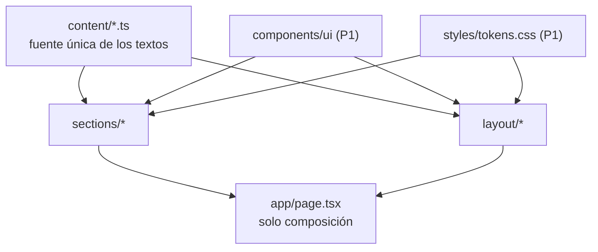

# P2 — Documento de construcción

## Resumen

| Campo | Valor |
|---|---|
| Paquete | P2 — Contenido tipado y secciones estáticas |
| Fecha inicio / fin | 2026-08-14 / 2026-08-14 |
| Commit final | `65eb06d` |
| Secciones del SPEC implementadas | §3 estructura · §5 contenido completo · §6 las once secciones · §8 accesibilidad |
| Estado | ✅ completado |

## Objetivo del paquete

El sitio completo, sin animación y sin API.

**Aceptación:** ningún texto de cara al usuario vive dentro de un componente ·
se ve como el prototipo en ambos modos · sin mención a facturación SRI (RN8).

## Qué se construyó

### Contenido tipado

`SPEC.md` §3 nombra los archivos en español; van en inglés por ADR-0001, que es
la convención de todo el repositorio. La correspondencia:

| SPEC | Archivo | Qué contiene |
|---|---|---|
| — | `content/types.ts` | Las formas: `Product`, `Work`, `Service`, `ProcessStep`, `Question`, `SectionHeading` |
| `productos.ts` | `content/products.ts` | Los cuatro, con su estado real |
| `trabajos.ts` | `content/works.ts` | Los seis, marcadores de posición |
| `servicios.ts` | `content/services.ts` | Los cinco |
| `proceso.ts` | `content/process.ts` | Los tres pasos |
| `preguntas.ts` | `content/questions.ts` | Las cuatro |
| — | `content/site-copy.ts` | Barra, portada, marquesina, encabezados, testimonio, contacto y pie |

`content/` no importa nada: `contenido-es-hoja` en dependency-cruiser falla si lo
hace.

### Composición

| Capa | Archivos |
|---|---|
| Estructura | `layout/container.tsx` (el `.env` del prototipo), `layout/section.tsx` (sección con encabezado de dos columnas y `.inv` opcional), `layout/nav-bar.tsx`, `layout/site-footer.tsx` |
| Secciones | `sections/{hero,marquee,products,works,services,process,quote,questions,contact}.tsx` |
| Página | `app/page.tsx` — **solo composición**: once líneas, ni un texto |

### Dos decisiones de contenido que no son estéticas

**El testimonio no se publica.** `QUOTE.pending` es `true` y `Quote` devuelve
nada. `SPEC.md` §5.4 dice que no se publica hasta tener el nombre real (C2), y
publicar una cita firmada por `[Nombre del cliente]` es peor que no tener
testimonio: dice que el sitio se armó con relleno. Cuando llegue el dato, se
cambia una línea en `content/` y el componente no se toca.

**El formulario apunta a `/api/contacto` desde ya.** Un `<form>` sin destino
envía por `GET` a la propia página y deja lo que escribió el visitante en la
barra de direcciones y en el historial. Hasta que P10 construya el endpoint, esto
responde 404: una señal honesta de "todavía no está" en lugar de una fuga
silenciosa.

## Diagrama del paquete



## Decisiones técnicas tomadas

| # | Decisión | Razón |
|---|---|---|
| 1 | `next/image` con `fill` para las portadas de trabajos | `SPEC.md` §9 lo pide, y evita el `eslint-disable` que exigiría un `` |
| 2 | `WorkCover` es una unión discriminada: tipográfica **o** imagen | El criterio de P10 es que el componente no haya que reescribirlo cuando lleguen las capturas (C1). Eso se decide en el tipo, no después |
| 3 | `h3` donde el prototipo usa `h4`, en servicios y proceso | Saltarse un nivel rompe la jerarquía de encabezados (`SPEC.md` §8.6) y visualmente no cambia nada: el tamaño lo pone el CSS |
| 4 | La marquesina va con `aria-hidden` | Es decorativa y repite lo que las secciones ya dicen; leer ocho términos en bucle estorba |
| 5 | `satisfies` en `HEADINGS` en vez de `Record<string, …>` | Cada encabezado se valida contra el tipo y las claves siguen siendo conocidas, sin búsquedas que puedan salir vacías |

## Pruebas

| Tipo | Cantidad | Qué cubren |
|---|---|---|
| Reglas del contenido | 17 | RN8 · alcance comercial · sin cifras · cantidades del SPEC · identificadores únicos · estados de producto · marcadores pendientes · **ningún texto en un componente** |
| **Nuevas en P2** | **17** | Total del proyecto: **93** |

La última es el criterio de aceptación del paquete, hecho ejecutable: recorre
`src/components` y `src/app`, quita los comentarios y busca texto suelto entre
etiquetas JSX. Si alguien escribe una palabra en un componente, falla.

## Problemas encontrados y cómo se resolvieron

| Problema | Solución | Tiempo perdido |
|---|---|---|
| **Bug real en `audit:secrets`**: `git ls-files` lista lo que está en el índice, incluido lo borrado del árbol y aún sin commitear. Al borrar la vista de P1, el verificador reventó con `ENOENT` | Filtrar por existencia antes de leer | Bajo — y lo encontró la propia auditoría |
| Se me coló un `eslint-disable` para usar `` | `next/image` con `fill`, que además es lo que pide `SPEC.md` §9 | Bajo |
| La primera versión del check de "texto en componentes" señalaba comentarios | Quitar comentarios antes de escanear | Bajo |
| `ContactForm` pasaba de 40 líneas | Se extrajo `TextInput`, que además quita cuatro repeticiones idénticas | Bajo |

## Deuda y pendientes

Ninguna deuda. Pendiente de paquetes posteriores y del cliente:

- **P3**: RA-01 a RA-05, incluido el registro nocturno de la portada, que en el
  prototipo lo genera JavaScript.
- **P10**: `POST /api/contacto` con validación en servidor, campo trampa y
  confirmación sin recargar.
- **C1** (cliente): seis trabajos reales. Cambia `content/works.ts`; los
  componentes no se tocan.
- **C2** (cliente): nombre y cargo del testimonio, o se retira la sección.
- **C3** (cliente): número de WhatsApp y texto previo del mensaje.

## Cómo probar manualmente lo construido

```bash
npm run build && npm start
```

1. Recorrer la página entera en los dos modos: debe verse como el prototipo.
2. `Tab` de arriba abajo: el foco se ve siempre; el acordeón abre con `Enter`.
3. Reducir a 360 px: productos y servicios caen a una columna, trabajos a una.
4. Con `prefers-reduced-motion`, todo sigue visible.

```bash
# Las reglas del contenido
npx vitest run src/content/content.spec.ts

# Y sobre el HTML servido
curl -s localhost:3000/ | grep -c "<h1"                        # → 1
curl -s localhost:3000/ | grep -ci "sri"                       # → 0
curl -s localhost:3000/ | grep -c "Nombre del cliente"         # → 0
```
