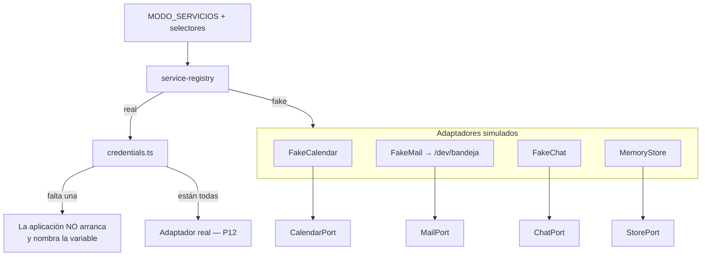

# P4 — Documento de construcción

## Resumen

| Campo | Valor |
|---|---|
| Paquete | P4 — Puertos, adaptadores simulados y selector de modo |
| Fecha inicio / fin | 2026-08-14 / 2026-08-14 |
| Commit final | `b0a4789` |
| Secciones implementadas | `BUILD.md` §2 y §3 completas · `CLAUDE.md` §12 |
| Estado | ✅ completado |

## Objetivo del paquete

La arquitectura de `BUILD.md` §2 y §3: cuatro puertos, sus cuatro adaptadores
simulados y el selector que decide cuál se inyecta.

**Aceptación:** arranca en `demo` sin credenciales · en `real`, si falta una
credencial la app no arranca y dice cuál (RN10) · nunca cae a simulado en
silencio.

## Qué se construyó

### Dominio

| Elemento | Archivo | Por qué existe ya |
|---|---|---|
| `TimeRange` | `modules/availability/domain/time-range.ts` | Los puertos necesitan hablar de bloques ocupados sin pasar dos `Date` sueltos, que es lo que prohíbe `CLAUDE.md` §3. El motor de P5 construye sobre esto |

### Puertos

`BUILD.md` §2 los nombra en español; van en inglés por ADR-0001. La
correspondencia:

| BUILD.md | Archivo | Qué garantiza su forma |
|---|---|---|
| `CalendarioPort` | `modules/availability/application/ports/calendar-port.ts` | **RN1 está en el tipo**: `busyRanges` devuelve intervalos y nada más. Un adaptador no puede filtrar el detalle de la agenda aunque quiera, porque no hay dónde ponerlo |
| `CorreoPort` | `modules/lead/application/ports/mail-port.ts` | El cuerpo llega renderizado: el puerto no sabe de plantillas |
| `ChatPort` | `modules/chat/application/ports/chat-port.ts` | **Devuelve texto, no órdenes**: no hay forma de pedirle al modelo que ejecute nada (RN9) |
| `AlmacenPort` | `shared/application/ports/store-port.ts` | Guardar, leer y borrar por identificador. Estrecho a propósito |

### Adaptadores simulados

| Adaptador | Qué hace |
|---|---|
| `FakeCalendar` | Bloques ocupados **deterministas**: dos por día hábil, siempre los mismos, nunca en fin de semana. Aplica la validación de doble reserva |
| `FakeMail` | No envía: guarda en una bandeja en memoria visible en `/dev/bandeja`. Del registro sale que se envió, nunca a quién ni qué |
| `FakeChat` | Máquina de estados determinista sobre un guion de `content/`. **Ignora lo que diga el visitante** al decidir qué responder |
| `MemoryStore` | `Map` detrás del puerto. Muere con el proceso, que es lo correcto en v1 |

Todos comparten `fake-behaviour.ts`: latencia simulada y un **interruptor** de
fallo. Interruptor y no dado: un adaptador que falla al azar vuelve las pruebas
intermitentes y las demostraciones impredecibles, que es lo contrario de lo que
`BUILD.md` §3 busca.

### El selector

`shared/infrastructure/config/service-registry.ts` resuelve el modo de cada
servicio: el global de `MODO_SERVICIOS`, y encima el selector individual si está.
Eso es lo que permite pasar a real **un servicio a la vez** en P12.

Pedir un servicio en `real` hace dos cosas, en este orden:

1. Exige sus credenciales. Si falta una, **la aplicación no arranca** y el
   mensaje nombra cuáles faltan.
2. Busca el adaptador real. Los reales llegan en P12; hasta entonces, pedir
   `real` con las credenciales puestas **también** detiene el arranque, con un
   mensaje que lo dice.

Lo que no pasa en ningún camino es caer a simulado en silencio.

La composición ocurre **al cargar el módulo**, no al primer uso: una
configuración mala tiene que tumbar el arranque, no aparecer en la cara del
primer visitante.

### Bandeja de correo

`/dev/bandeja` muestra los correos que el sistema habría enviado. **Solo en
desarrollo**: en producción devuelve 404, y no por una comprobación de permisos
sino porque ahí se ven correos enteros —destinatario y cuerpo— que es justo lo
que no puede salir de un servidor de verdad.

## Diagrama del paquete



## Decisiones técnicas tomadas

| # | Decisión | Razón |
|---|---|---|
| 1 | El fallo simulado es un interruptor, no una probabilidad | Pruebas deterministas y demostraciones que siempre hacen lo mismo |
| 2 | Pedir `real` con credenciales puestas también detiene el arranque | El adaptador real no existe hasta P12; seguir sería caer a simulado en silencio, que es exactamente lo que prohíbe RN10 |
| 3 | El registro se compone al cargar el módulo | Una configuración mala tiene que impedir el arranque, no fallar en la primera petición |
| 4 | `StorePort<T>` genérico, y el registro expone `createStore<T>()` | Quién guarda qué lo deciden P6 y P8; un almacén concreto acá sería adivinar |
| 5 | `environmentSource` se expone desde `environment.ts` | Los nombres de credenciales dependen de qué servicios estén en real, así que no entran al esquema. Aun así `environment.ts` sigue siendo el único archivo que toca `process.env` |
| 6 | El guion del bot simulado vive en `content/` | Es texto de cara al usuario. Además cumple RN5 y RN6 por construcción: deriva a proforma y no afirma disponibilidad |

## Pruebas

| Archivo | Cantidad | Qué fija |
|---|---|---|
| `service-registry.spec.ts` | 11 | **RN10 completo**: demo sin credenciales arranca; real sin credenciales no; el mensaje nombra las variables; una credencial vacía cuenta como ausente; el selector individual manda sobre el global |
| `fake-calendar.spec.ts` | 8 | Determinismo, sin fines de semana, **RN1 sobre la forma del dato**, y **RN2**: el segundo intento sobre el mismo espacio se rechaza |
| `fake-chat.spec.ts` | 6 | Determinismo, **RN13** (un mensaje con instrucciones incrustadas no cambia nada) y **RN5** (no da cifras ni preguntándoselo cuatro veces) |
| `fake-mail.spec.ts` | 4 | Bandeja, orden, y **RN12**: el registro no lleva destinatario, asunto ni cuerpo |
| `memory-store.spec.ts` | 5 | Guardar, leer, sobrescribir y **borrar de verdad**, que es la vía de borrado que exige LOPDP |
| `time-range.spec.ts` | 4 | Validez, solape en ambas direcciones, y que tocarse en el borde no sea solaparse |
| **Nuevas en P4** | **38** | Total del proyecto: **135** |

## Problemas encontrados y cómo se resolvieron

| Problema | Solución | Tiempo perdido |
|---|---|---|
| La primera versión de `guardReal` leía `process.env` directamente, así que la prueba de RN10 dependía del entorno de quien la corriera | La fuente de credenciales entra por parámetro | Bajo |
| `knip` señaló ocho exports sin consumidor fuera de su módulo | Dejaron de exportarse | Bajo |
| `max-depth` saltó a 4 al generar los bloques sembrados | Se extrajo `blocksOfDay` | Bajo |
| Un `next build` con `MODO_SERVICIOS=real` deja el directorio de salida a medias y el servidor no levanta | Es el comportamiento correcto —el build falló como debía—; hay que reconstruir en demo. Anotado en el runbook | Bajo |

## Deuda y pendientes

Ninguna deuda.

- **P5** construye el motor sobre `TimeRange` y consume `CalendarPort`.
- **P6** usa `createEvent` y agrega la verificación de concurrencia del lado del
  caso de uso (RN2 completo).
- **P9** renderiza las cuatro plantillas y las revisa en `/dev/bandeja`.
- **P12** escribe los cuatro adaptadores reales, uno a la vez.

## Cómo probar manualmente lo construido

```bash
# 1. Arranca en demo sin una sola credencial
npm run build && npm start
curl -s localhost:3000/api/estado          # → {"estado":"ok","modo":"demo"}

# 2. RN10: en real sin credenciales, NO arranca y dice cuál falta
MODO_SERVICIOS=real npx next build
# → El servicio "calendar" está configurado en modo real y faltan estas variables:
#   GOOGLE_CALENDAR_ID, GOOGLE_SERVICE_ACCOUNT_EMAIL, GOOGLE_PRIVATE_KEY
# (después hay que reconstruir en demo: el build fallido deja la salida a medias)

# 3. La bandeja de correo no existe en producción
curl -s -o /dev/null -w "%{http_code}" localhost:3000/dev/bandeja    # → 404

# 4. En desarrollo sí
npm run dev    # y abrir localhost:3000/dev/bandeja
```
