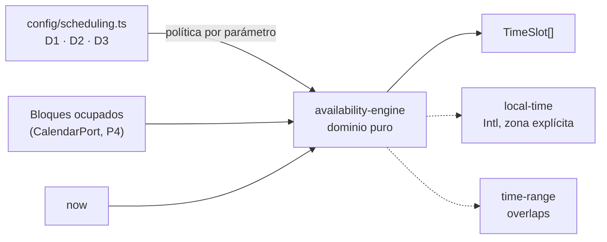

# P5 — Documento de construcción

## Resumen

| Campo | Valor |
|---|---|
| Paquete | P5 — Motor de disponibilidad · **camino crítico** |
| Fecha inicio / fin | 2026-08-14 / 2026-08-14 |
| Commit final | `{hash}` |
| Decisiones implementadas | D1, D2 y D3 de `DECISIONES.md` |
| Estado | ✅ completado |

## Objetivo del paquete

El corazón del dominio, puro y probado: dado un conjunto de bloques ocupados y
las reglas de negocio, devolver los espacios libres.

**Aceptación:** las pruebas corren con la base apagada, sin red y sin Google
Calendar · casos límite cubiertos: borde de horario, margen entre reuniones,
aviso mínimo, día lleno, cambio de día.

## Qué se construyó

### Dominio — y nada más que dominio

| Archivo | Qué resuelve |
|---|---|
| `domain/scheduling-policy.ts` | Las reglas **como dato**: zona, días, tramos, duración, margen, aviso, ventana y tope diario |
| `domain/local-time.ts` | Instante ↔ reloj de pared de una zona, con `Intl`. Sin dependencias |
| `domain/time-slot.ts` | `TimeSlot` y `SlotId`, una cadena marcada |
| `domain/availability-engine.ts` | El motor |
| `config/scheduling.ts` | Los valores de D1–D3, versionados |

**El dominio no importa la configuración.** Es al revés: quien compone le pasa la
política al motor. Por eso el motor se puede probar con cualquier horario sin
tocar una línea, y por eso cambiar el horario real cuando el usuario lo confirme
(B4) es editar un archivo de configuración.

### Las siete reglas, y dónde vive cada una

| Regla | Cómo la aplica el motor |
|---|---|
| D1 horario | Solo genera candidatos dentro de los tramos |
| D1 días | Solo días de la semana declarados hábiles |
| D3 duración | Cada espacio dura lo que diga la política |
| D3 margen | Descarta el espacio si él **o su margen** tocan algo ocupado |
| D3 aviso | Descarta lo que empiece antes de `now` + aviso mínimo |
| D3 ventana | Recorre días **hábiles**, no naturales |
| D2 tope diario | Un día que ya llegó al tope no ofrece nada |

### Tres decisiones que valen la pena mirar

**`now` entra por parámetro.** Sin eso, probar el aviso mínimo de doce horas
obligaría a falsear el reloj. Una regla de negocio no debería necesitar eso para
verificarse, y las cuatro pruebas del borde de las doce horas son aritmética
pura.

**La zona es siempre explícita.** El motor no lee nunca la del servidor: un sitio
desplegado en Virginia tiene que ofrecer las mismas horas que uno desplegado en
Guayaquil. Hay una prueba que corre la misma consulta con `Europe/Madrid` y
comprueba que los instantes cambian.

**Ecuador no tiene horario de verano, y no se aprovecha.** El desfase se calcula
para cada instante igual que en cualquier otra zona. Dar por sentado UTC−5 es la
clase de atajo que funciona hasta que un país cambia de regla.

## Diagrama del paquete



## Decisiones técnicas tomadas

| # | Decisión | Razón |
|---|---|---|
| 1 | `now` por parámetro, nunca del reloj | Probar el aviso mínimo sin falsear el tiempo |
| 2 | La zona sale de la política, nunca del servidor | El sitio tiene que dar las mismas horas se despliegue donde se despliegue |
| 3 | El tope diario cuenta **todo bloque ocupado del día** | Es lo único que el motor puede saber, y se equivoca hacia el lado seguro: ofrece de menos, nunca de más |
| 4 | La ventana cuenta desde hoy, no desde el primer día agendable | Es un techo, no una promesa. Registrado en `casos-conocidos.md` M5 |
| 5 | El margen es un **mínimo**: dejar exactamente diez minutos alcanza | Registrado en M8, porque es la clase de detalle que se interpreta al revés |
| 6 | `SlotId` es una cadena marcada | `CLAUDE.md` §3 prohíbe primitivos sueltos, y cuesta una línea |

## Pruebas

| Grupo | Cantidad | Qué fija |
|---|---|---|
| D1 horario y días | 4 | Nada fuera de los tramos, nada en fin de semana, el último espacio de cada tramo cabe entero, y un día libre da catorce |
| D3 aviso mínimo | 4 | Hoy no se agenda; el primero es mañana 09:00; **el borde exacto de las doce horas entra** y un minuto después ya no |
| D3 margen | 3 | Lo ocupado tapa lo pegado a sus bordes; exactamente el margen alcanza; con margen de veinte, lo que antes entraba deja de entrar |
| D2 tope diario | 3 | Día lleno no ofrece nada; con uno menos sigue ofreciendo; el tope no arrastra al día siguiente |
| D3 ventana | 2 | Días hábiles y no naturales; cruza el cambio de mes |
| Propiedades | 4 | Duración, identificadores estables y sin repetir, orden cronológico, cantidad total |
| Zona | 1 | La misma consulta en otra zona da otros instantes |
| `TimeSlot` | 3 | El identificador sale del instante de inicio |
| **Nuevas en P5** | **24** | Total del proyecto: **159** |

Todas corren **sin base de datos, sin red y sin servidor**. Esa era la prueba de
que las capas están bien cortadas, y pasa.

Los casos con su resultado esperado escrito a mano **antes de ejecutar** están en
`docs/pruebas/casos-conocidos.md`, M1 a M21.

## Problemas encontrados y cómo se resolvieron

| Problema | Solución | Tiempo perdido |
|---|---|---|
| **Cuatro pruebas fallaron y el equivocado era yo, no el motor.** Había escrito que un espacio que deja exactamente diez minutos de margen no cumple, y que la ventana daría diez días de oferta | El margen es un mínimo: exactamente diez alcanza. Y la ventana cuenta desde hoy, así que se ofrecen nueve días. Se corrigieron las expectativas y **las dos lecturas quedaron registradas** en `casos-conocidos.md` M5 y M8, que es justo para lo que sirve esa tabla | Medio — y fue el paquete haciendo su trabajo |
| `no-magic-numbers` señaló el archivo de configuración entero | `src/config/**` es una tabla de valores, no lógica: la regla se apagó ahí, como ya estaba para los archivos de configuración de herramientas | Bajo |
| `knip` señaló `SlotId` y `slotIdOf` sin consumidor fuera de su módulo | Dejaron de exportarse. P6 los exportará cuando necesite nombrarlos | Bajo |

## Deuda y pendientes

Ninguna deuda.

- **P6** expone el motor por HTTP, agrega la verificación de concurrencia (RN2
  completo) y los tokens de cancelación.
- **B4** (usuario): confirmar el horario real de atención. Es una línea en
  `config/scheduling.ts`; el motor no se toca.
- Si el usuario prefiere que la ventana sean diez días **ofrecidos** en vez de
  diez días hábiles hacia adelante, es una línea en `workdaysFrom` y hay que
  actualizar M5 y M6 de los casos conocidos.

## Cómo probar manualmente lo construido

```bash
# Los casos conocidos del motor, sin levantar nada
npx vitest run src/modules/availability/domain/

# Toda la batería
npm run audit
```

Para comprobar a mano que el motor no depende del reloj ni de la zona de la
máquina, se puede cambiar la zona del sistema operativo y volver a correr: los
resultados son idénticos.
