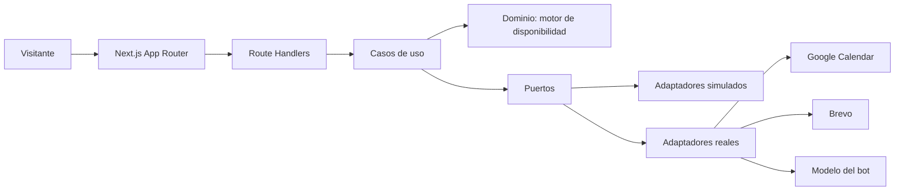
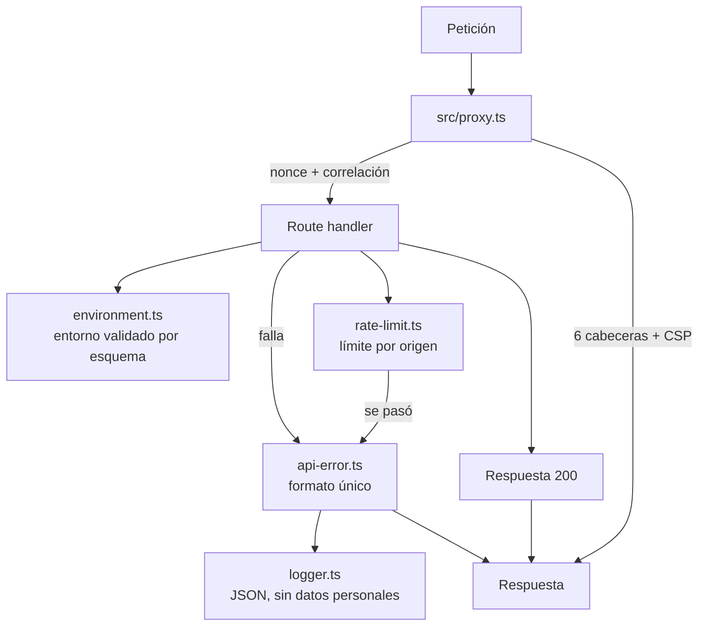
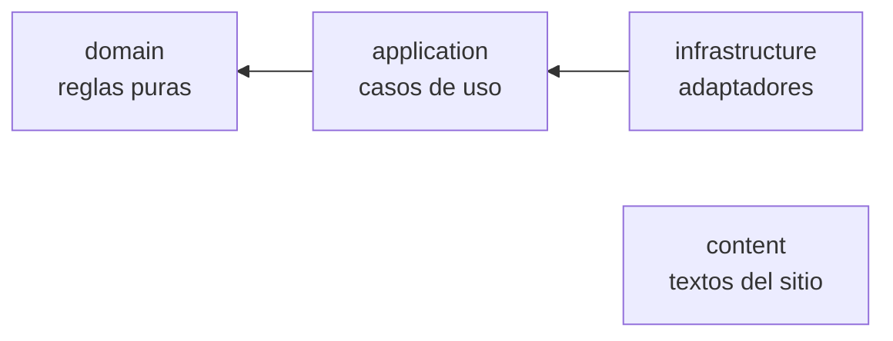
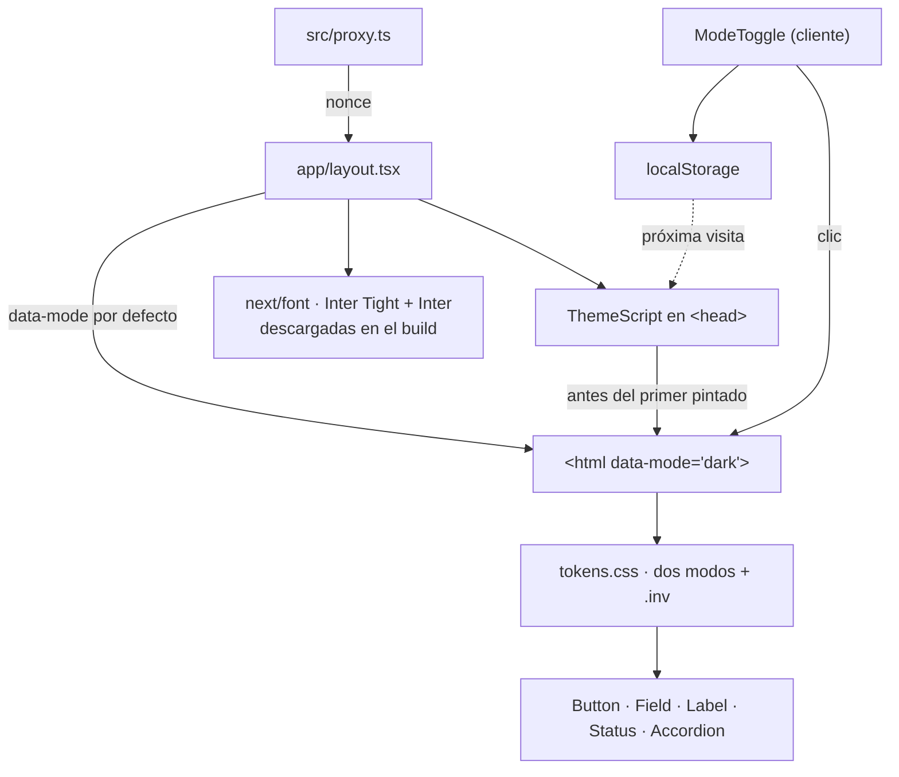
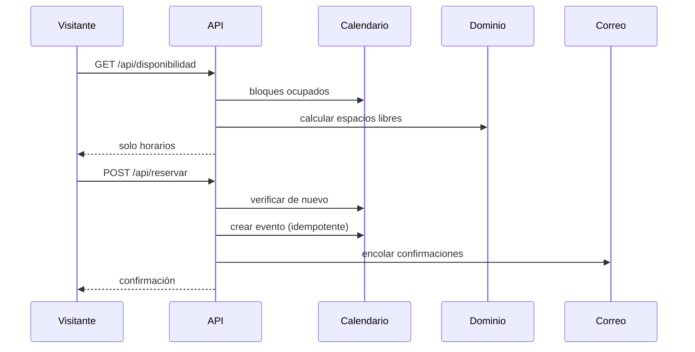

# Funcionamiento del sistema

## Visión

El selector `MODO_SERVICIOS` decide qué implementación se inyecta. **El sistema completo se recorre de punta a punta sin una sola credencial.**

## Lo construido hasta hoy — P0, la fundación

Existe el esqueleto y las cinco piezas transversales que toda superficie usa. No
hay dominio todavía: llega en P5.

| Pieza | Archivo | Qué garantiza |
|---|---|---|
| Proxy de entrada | `src/proxy.ts` | Una ruta nueva nace con cabeceras de seguridad, CSP con nonce y correlación. No hay forma de olvidarse |
| Entorno | `shared/infrastructure/config/environment.ts` | Único punto que lee `process.env`. Configuración mala = no arranca |
| Registro | `shared/infrastructure/logging/logger.ts` | RN12 por construcción: los campos personales salen `[redactado]` aunque alguien los registre por descuido |
| Formato de error | `shared/infrastructure/http/api-error.ts` | Un solo formato de error en todo el sistema; mensaje genérico afuera, detalle solo adentro |
| Limitador | `shared/infrastructure/http/rate-limit.ts` | Primera capa de `SEGURIDAD.md` §7, por origen |

### La regla de dependencia es ejecutable

`audit:arch` (dependency-cruiser) corre dentro de `audit:fast`, que bloquea el
commit. Cuatro reglas, todas en `error`:

| Regla | Qué prohíbe |
|---|---|
| `dominio-solo-dominio` | Que `domain/` importe cualquier cosa que no sea `domain/`: ni Next, ni React, ni SDKs, ni módulos de Node |
| `aplicacion-sin-infraestructura` | Que `application/` importe implementaciones concretas, rutas o componentes |
| `contenido-es-hoja` | Que `content/` importe nada. Si importa algo, dejó de ser contenido |
| `sin-ciclos` | Ciclos de imports |

`audit:forbidden` completa lo que un grafo de imports no ve: `process.env` dentro
de `domain/`, `any`, supresiones de compilador o linter, `dangerouslySetInnerHTML`,
scripts desde CDN, SQL interpolado y archivos `.env` versionados.

## La capa visual — P1

**Por qué no parpadea.** El `<html>` sale del servidor con el modo por defecto,
así que la paleta se aplica desde el primer byte —y la página se ve entera
aunque JavaScript esté deshabilitado—. El script del `<head>` es lo primero que
corre y corrige el modo antes de que el navegador pinte, si el visitante eligió
otro o su sistema pide otro.

**Cero valores literales en componentes.** Todo color, fuente y curva sale de
`tokens.css`. Los nombres de los tokens están en español, contra la convención
del resto del código, porque son el contrato visual que se comparte con Commerce
y Care (ADR-0008).

**El contraste se calcula, no se afirma.** `src/styles/contrast.spec.ts` lee
`tokens.css` y comprueba AA en los cuatro contextos: los dos modos, cada uno con
y sin franja invertida. Si alguien retoca un token, la prueba falla con el número
exacto.

## Flujo de reserva *(llega en P6)*

La doble verificación antes de crear es lo que impide la doble reserva.

## Regla que ordena el diseño

El bot **no ejecuta nada**. Produce una ficha; el servidor la valida contra esquema y decide. Por eso el módulo `chat` no depende de `booking` ni de `lead`: entrega datos, no órdenes.
