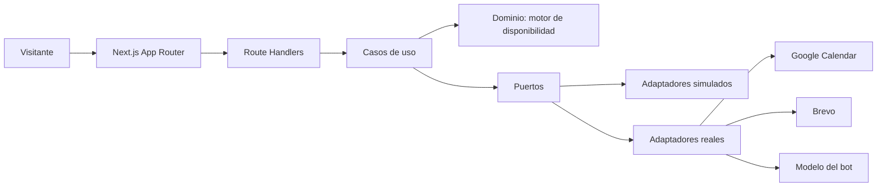
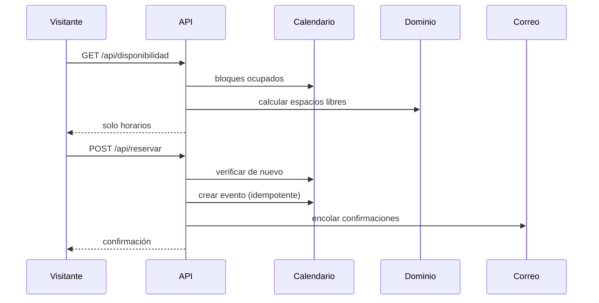

# Funcionamiento del sistema

## Visión

El selector `MODO_SERVICIOS` decide qué implementación se inyecta. **El sistema completo se recorre de punta a punta sin una sola credencial.**

## Flujo de reserva

La doble verificación antes de crear es lo que impide la doble reserva.

## Regla que ordena el diseño

El bot **no ejecuta nada**. Produce una ficha; el servidor la valida contra esquema y decide. Por eso el módulo `chat` no depende de `booking` ni de `lead`: entrega datos, no órdenes.
